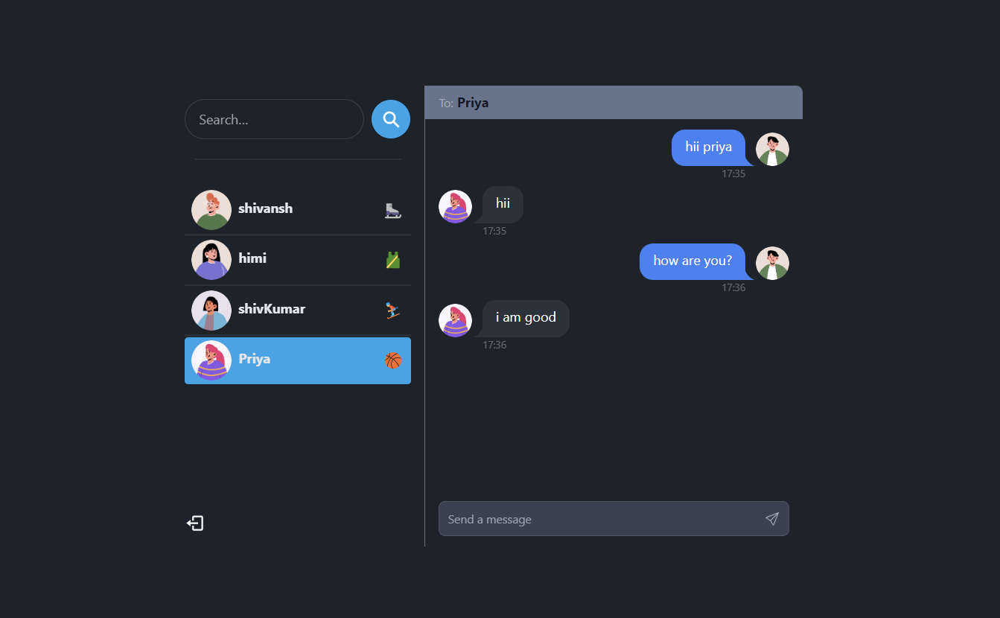
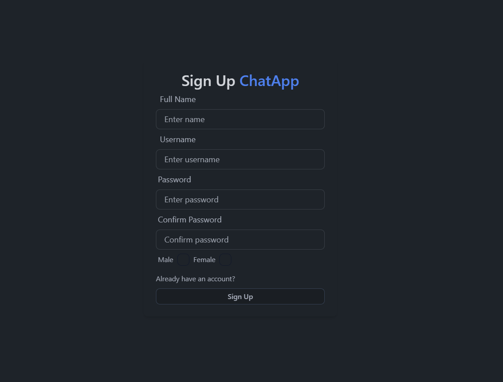

# Chat Server

MERN Stack Project: Build and Deploy a Real Time Chat App | JWT, Socket.io

## Screenshot

# Home Page

# Chat Page

## Modules Used

- **Express**: For building the server and handling HTTP requests.
- **Socket.io**: For real-time communication between the server and clients.
- **HTTP**: For creating the HTTP server.
- **Users Utility Functions**: Custom utility functions for managing users in the chat.
- **Messages Utility Function**: Custom utility function for formatting chat messages.

## How to Run

1. Make sure you have Node.js installed on your machine.
2. Clone this repository.
3. Install the dependencies using `npm install`.
4. Run the server using `npm start` or `node server.js`.
5. Open your browser and navigate to `http://localhost:8080` to access the chat application.

## Functionality

- Users can join different chat rooms.
- Upon joining, users receive a welcome message.
- Users can chat in real-time with other users in the same room.
- When a user leaves the chat, a leave message is broadcasted to the room.
- The server keeps track of the users in each room and updates the user list accordingly.

## Server Configuration

The server is configured to run on port 8080. You can modify the port number in the `server.js` file if needed.

## Contributors

- [Shivansh Chourasia](https://github.com/shivansh84ya)

Feel free to contribute to this project by submitting pull requests or reporting issues.
